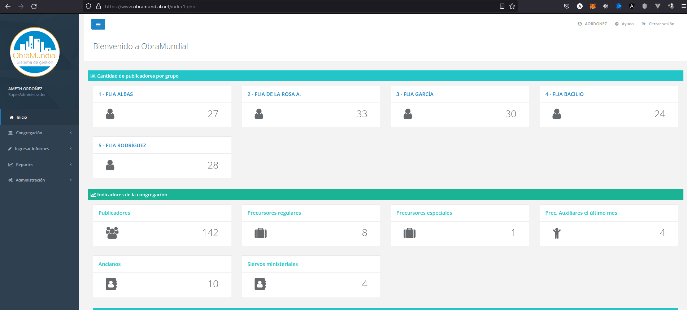
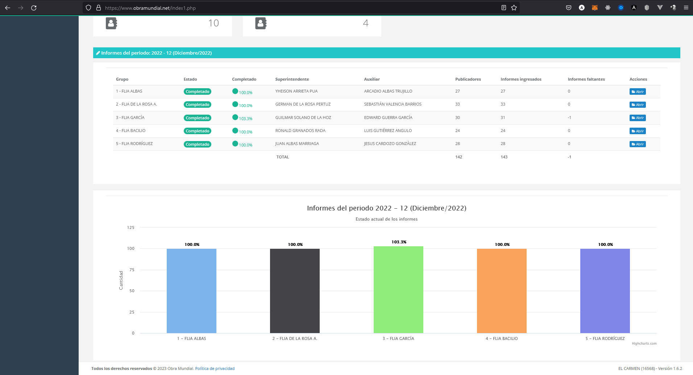
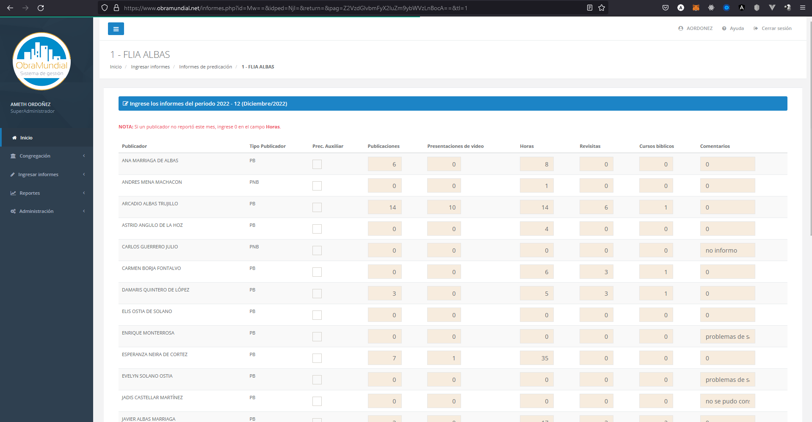

# ObraMundial.net

ObraMundial es un sitio de gestión de informes y publicadores para las congregaciones.

Visite: [www.obramundial.net](https://www.obramundial.net)

## Incluye
### Módulos
- Administración de información de publicadores
- Gestión de grupos de predicación
- Control de asistencia a las reuniones
- Gestión de usuarios
- Permisos por perfiles
- Multi-congregación

### Reportes
- Informe mensual de servicio del campo, en formato listo para cargar a jw.org
- Informe de servicio de la congregación
- Informe de publicadores por grupo
- Informes de precursores
- Generación automática de la tarjeta S-21

## Contribución
Los pull requests son bienvenidos. Para cambios importantes, abra un problema primero para discutir qué le gustaría cambiar.

Asegúrese de actualizar las pruebas según corresponda. 

## Licencia
[GNU/GLP](https://www.gnu.org/licenses/gpl-3.0.html)

